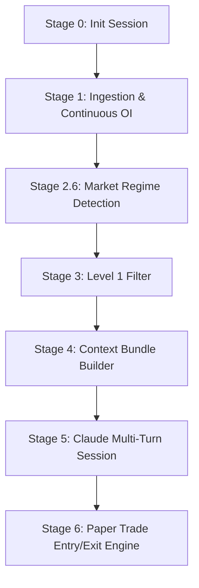
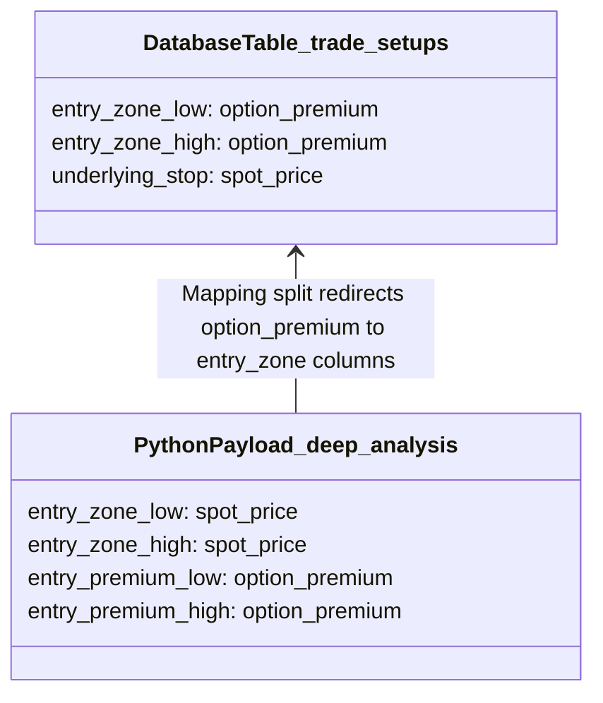

# GEMINI_AUDIT_v8.md
**Design Specification & Variable Name Audit — Daily AI Market Analyzer**

**Version**: v8 — June 2026
**Codebase**: daily-ai-market-analyzer @ main
**Prepared by**: Antigravity (Gemini 3.5 Flash Model) via complete codebase review
**Status**: COMPLETE SYSTEM AUDIT & DESIGN SPECIFICATION

---

## TABLE OF CONTENTS

1. [System Flow & Architecture](#1-system-flow--architecture)
2. [System-Wide Design Decisions](#2-system-wide-design-decisions)
3. [Step-by-Step AI Payloads (Protos) & Intent](#3-step-by-step-ai-payloads-protos--intent)
   - [System Prompt (Turns 1 & 2)](#system-prompt-turns-1--2)
   - [Turn 1 — Market Context (Exact Proto & Intent)](#turn-1--market-context-exact-proto--intent)
   - [Turn 2 — Pre-scan (Exact Proto & Intent)](#turn-2--pre-scan-exact-proto--intent)
   - [Turns 3+ — Deep Analysis (Exact Proto & Intent)](#turns-3--deep-analysis-exact-proto--intent)
   - [Chat Endpoint — /api/chat (Exact Proto & Intent)](#chat-endpoint--apichat-exact-proto--intent)
4. [Variable Name & Design Audit](#4-variable-name--design-audit)
5. [Database Schema Map](#5-database-schema-map)
6. [API Endpoints Map](#6-api-endpoints-map)

---

## 1. System Flow & Architecture

The **Daily AI Market Analyzer** is an automated stateful trading analyzer designed for swing trading Nifty 50 constituents in the Indian F&O markets. It coordinates data ingestion, indicator calculations, multi-turn AI interactions with Claude, Telegram alerts, and paper trade simulation.

### Daily Timeline & Scheduler
The system runs via a series of cron jobs scheduled in [scheduler.py](file:///C:/Users/29abh/Projects/Trading/daily-ai-market-analyzer/scheduler.py):
*   **06:00 Daily** — `job_keepalive`: Ping Supabase database to maintain active session.
*   **07:00 Mon-Fri** — `job_morning_brief`: Compile open paper trades, silent watchlists, and market sentiment, and dispatch a structured morning brief to Telegram.
*   **15:20 Mon-Fri** — `job_option_snapshot`: Capture option chain snapshots (OI, IV, volume, premium) just prior to close.
*   **18:30 Mon-Fri** — `job_bhavcopy`: Download NSE bhavcopies (equity indices, constituent OHLCV, FII/DII net flows).
*   **19:00 Mon-Fri** — `job_token_reminder`: Alert the user if the Kite OAuth token has expired or is missing.
*   **19:00, 19:30, 20:00 Mon-Fri** — Retries for the bhavcopy job if NSE downloads fail.
*   **21:30 Mon-Fri** — `job_preflight_check`: Verify Kite token validity, database status, and that Bhavcopy and Options Snapshot runs completed successfully.
*   **22:00 Mon-Fri** — `run_pipeline` in [orchestrator.py](file:///C:/Users/29abh/Projects/Trading/daily-ai-market-analyzer/pipeline/orchestrator.py): The primary analysis routine.

### Nightly Pipeline Execution Stages
When [orchestrator.py](file:///C:/Users/29abh/Projects/Trading/daily-ai-market-analyzer/pipeline/orchestrator.py) starts at 22:00 IST, it executes the following sequential steps:



1.  **Stage 0: Session Init**
    Creates or reuses a row in `analysis_sessions` for the current trade date, setting status to `RUNNING`.
2.  **Stage 1: Ingestion & Continuous OI**
    Fetches raw market data and runs `oi_series_builder.py` to compile Continuous OI series (rolling near/next month OI, calculating PCR and Max Pain levels).
3.  **Stage 2.6: Market Regime Detection**
    Analyzes Nifty 50 and India VIX price history to classify the macro regime (e.g., `BULL_TRENDING`, `SIDEWAYS_TIGHT`) and trend metrics (EMA20, EMA50, 20-day returns).
4.  **Stage 3: Level 1 Filter**
    Excludes constituents based on 3 hard criteria:
    *   **Earnings Guard**: Company reports earnings within 5 trading days.
    *   **ATR Dead Guard**: ATR(14) is < 0.8% of spot price (shadow tracked for 5 days).
    *   **Option Liquidity Guard**: Combined ATM CE + PE Open Interest is < 10,000 contracts (shadow tracked for 5 days).
5.  **Stage 4: Context Bundle Builder**
    Queries Supabase to assemble a complete state package (system configurations, active watchlist stocks, current open positions, recent trade outcomes, and available trade slots).
6.  **Stage 5: Claude Multi-Turn Session**
    Initializes a stateful Anthropic connection.
    *   **Turn 1**: Submits macro market context; receives a macro narrative, risk flags, and support/resistance zones.
    *   **Turn 2**: Submits technical indicators for all stocks passing Level 1; receives triage priorities (`HIGH`, `MEDIUM`, `LOW`, `SKIP`).
    *   **Turns 3+ (Stateless)**: Loops through prioritized stocks for deep technical analysis and options pricing parameters. Evaluates setups and writes outcomes (`TRADE_READY`, `WATCH`, `ON_RADAR`, `SKIP`) to Supabase.
7.  **Stage 6: Paper Trade Engine**
    [paper_trade_engine.py](file:///C:/Users/29abh/Projects/Trading/daily-ai-market-analyzer/pipeline/paper_trade_engine.py) checks if any pending watch setups triggered entry (touches entry zone within 2 days) and tracks exits for open trades (Stop Loss hit intraday, Target 1 partial exit, Target 2 full exit, or Day 5 expiry stop).

---

## 2. System-Wide Design Decisions

| Category | Decision | Rationale & Code Reference |
| :--- | :--- | :--- |
| **Session State Isolation** | Stateful Turn 1 + Turn 2, Stateless Turns 3+ | Turn 1 and 2 share a stateful message thread to build narrative context before prescan triage. Turns 3+ run in isolated, stateless requests per stock to avoid context window explosion, keep API costs predictable, and prevent cross-talk. |
| **Cost Control** | Ephemeral prompt caching on System Prompts | System prompts contain heavy context blocks (watchlist, open positions). Appending `"cache_control": {"type": "ephemeral"}` in [claude_session.py](file:///C:/Users/29abh/Projects/Trading/daily-ai-market-analyzer/pipeline/claude_session.py) triggers Anthropic Prompt Caching, cutting input token costs by 50-70%. |
| **Financial Safety** | Python-authoritative position sizing overrides | Claude cannot consistently perform position sizing math. Python overrides Claude's outputs using exact formulas, capping trades at ₹12,500 risk (2.5% of ₹5,00,000 capital), limiting setups to 5 lots max, and enforcing a hard R:R >= 2.0 gate. |
| **Risk Spreading** | Sector correlation check in Python | The AI deep analysis is stateless and cannot correlate trades across stocks. Python tracks approved trades in `trade_ready_list`; if a stock has the same sector and direction as an already accepted trade, it is automatically downgraded to `WATCH`. |
| **Watchlist Lifecyle** | Staging progression with hard expiry gates | Watchlist entries have a strict 10-day limit. If a stock remains on `WATCH` or `ON_RADAR` for > 10 days without triggering an entry, it is marked `EXPIRED` and removed. If conviction drops below 55, it is downgraded to `DEGRADED`. |

---

## 3. Step-by-Step AI Payloads (Protos) & Intent

This section details the exact data contracts ("protos") passed to the AI model in each phase, the appended system instructions, and the downstream processing of output parameters.

### System Prompt (Turns 1 & 2)
*   **Source File**: [system_prompt_builder.py](file:///C:/Users/29abh/Projects/Trading/daily-ai-market-analyzer/pipeline/system_prompt_builder.py)
*   **Format**: Plain text injected into the Anthropic API `system` array.

```text
You are an experienced hedge fund manager and swing trading mentor specialising in Indian F&O markets (Nifty 50 stocks, 2-5 day holds, stock options only — monthly Tuesday expiry).

━━━━━ TONIGHT'S SESSION CONTEXT ━━━━━
Date          : {date_str}
Market Regime : {regime}  (Nifty {nifty_close:.1f} | VIX {vix:.2f})
Trade Slots   : {available_slots} of {max_slots} available
Capital at Risk: ₹{open_risk:,.0f} ({open_risk_pct:.1f}%)

━━━━━ ROLLOVER CONTEXT ━━━━━
[{rollover_phase}]: {rollover_text}
  (Near expiry: {near_expiry} | Rollover %: {rollover_pct:.1f}%)

━━━━━ PCR INTERPRETATION GUIDE ━━━━━
PCR is contrarian at extremes:
PCR < 0.7  → contrarian bearish (excessive bullishness)
PCR 0.7-1.1 → neutral
PCR > 1.3  → contrarian bullish (excessive bearishness)
Do NOT interpret high PCR as automatically bearish.

━━━━━ SIGNAL PERFORMANCE ━━━━━
[Phase 1: Signal attribution building — use general judgment.]

━━━━━ RECENT OUTCOMES ━━━━━
  {symbol}     {setup_date}  → {paper_outcome}

━━━━━ ACTIVE WATCHLIST ━━━━━
  {symbol}     stage={stage} ({days_in_stage}d)

━━━━━ OPEN POSITIONS ━━━━━
  {symbol}     {direction}

━━━━━ OPERATING RULES ━━━━━
Capital        : ₹5,00,000
Risk per trade : 2-3% (₹10,000-15,000)
Min RR         : 1:2 (hard gate — reject below)
Max setups     : {available_slots} Trade Ready tonight
Min DTE        : 6 trading days
Expiry         : Monthly Tuesday
Instruments    : Stock options ONLY
Sector rule    : No two stocks from same sector + same direction
Do NOT force setups — SKIP is always valid
```

---

### Turn 1 — Market Context (Exact Proto & Intent)

#### Input JSON Payload ("Proto")
```json
{
  "turn": "market_context",
  "session_date": "YYYY-MM-DD",
  "regime": "BULL_TRENDING | BULL_VOLATILE | SIDEWAYS_TIGHT | SIDEWAYS_WIDE | BEAR_VOLATILE | BEAR_TRENDING",
  "nifty_close": 24350.5,
  "vix_close": 14.2,
  "ema20": 24100.0,
  "ema50": 23800.0,
  "ret20d_pct": 2.5,
  "nifty_30d": [
    { "date": "YYYY-MM-DD", "close": 24300.0, "high": 24350.0, "low": 24250.0 }
  ],
  "vix_30d": [
    { "date": "YYYY-MM-DD", "close": 14.2 }
  ],
  "fii_dii_30d": [
    { "date": "YYYY-MM-DD", "fii_net_cr": 1234.5, "dii_net_cr": -500.0 }
  ],
  "nifty_oi_walls": {
    "ce_walls": [
      { "strike": 24500, "oi": 5000000 }
    ],
    "pe_walls": [
      { "strike": 24000, "oi": 4500000 }
    ]
  }
}
```

#### Turn 1 Input Intent
*   `turn`: Tells the model this is the initial macro narrative setup.
*   `session_date` / `regime`: Sets the base time context and pre-computed macro direction.
*   `nifty_close` / `vix_close` / `ema20` / `ema50` / `ret20d_pct`: Gives baseline index trend metrics.
*   `nifty_30d` / `vix_30d`: Permits trend/gap/support analysis over the past month.
*   `fii_dii_30d`: Institutional flows (sustained FII buying confirms market strength).
*   `nifty_oi_walls`: Top 5 Call and Put strikes, establishing global index support and resistance.

#### Turn 1 Appended Instructions
```text
Analyse the market context above. Factor in the Nifty 50 OI walls (Support=PE walls, Resistance=CE walls) when defining key levels and narrative. Respond with ONLY a JSON object — no commentary outside the JSON:
{
  "session_narrative": "3-4 sentences on market condition and tone tonight",
  "risk_flags": ["key risk 1", "key risk 2"],
  "favourable_setups": "LONG | SHORT | NEUTRAL | BOTH",
  "index_key_levels": {"support": 0, "resistance": 0}
}
```

#### Expected Output Schema
```json
{
  "session_narrative": "Market exhibits strong bullish momentum backed by FII net buying and index consolidation above EMA20. The 24000 level represents solid support based on PE OI walls.",
  "risk_flags": [
    "Rising India VIX indicates volatility consolidation",
    "Call writing wall at 24500 limits immediate upside"
  ],
  "favourable_setups": "LONG",
  "index_key_levels": {
    "support": 24000,
    "resistance": 24500
  }
}
```

#### Downstream Usage
*   Parsed values are stored in memory and displayed in the frontend dashboard.
*   Passed to the chat formatting utility `/api/session/today/chat-context` to reconstruct the night's market narrative for manual QA.

---

### Turn 2 — Pre-scan (Exact Proto & Intent)

#### Input JSON Payload ("Proto")
```json
{
  "turn": "prescan",
  "session_date": "YYYY-MM-DD",
  "stock_count": 38,
  "stocks": [
    {
      "sym": "HDFCBANK",
      "close": 1650.25,
      "closes_30d": [1600.0, 1610.0, 1650.25],
      "rsi14": 58.4,
      "ema20": 1620.3,
      "ema50": 1583.7,
      "atr_pct14": 1.24,
      "vol_ratio": 1.83,
      "oi_10d": [12500000, 13100000],
      "futures_price": 1653.4,
      "basis_pct": 0.19,
      "pcr_near": 0.85,
      "max_pain": 1600,
      "rollover_phase": "NORMAL"
    }
  ]
}
```

#### Turn 2 Input Intent
*   `stocks`: Contains technical snapshots for all constituents passing Level 1.
*   `closes_30d` / `rsi14` / `ema20` / `ema50` / `vol_ratio`: Technical inputs. Allows the model to assess momentum and trend status (price > EMA20 > EMA50 confirms uptrend).
*   `oi_10d` / `futures_price` / `basis_pct` / `pcr_near`: Option interest trends. Basis expansion indicates bullish premium buying; rising OI indicates fresh accumulation.
*   `rollover_phase` / `max_pain`: Provides details about contract rollover risk and expiry proximity.

#### Turn 2 Appended Instructions
```text
Pre-scan all {N} stocks above. For each stock, assess direction and priority based on the data provided. Respond with ONLY a JSON array — one object per stock, no commentary:
[
  {
    "symbol": "HDFCBANK",
    "direction": "LONG | SHORT",
    "pre_scan_reasoning": "2-3 lines max",
    "priority": "HIGH | MEDIUM | LOW | SKIP",
    "forward_to_deep": true,
    "override_level1": false,
    "override_reason": null
  },
  ...
]
```

#### Expected Output Schema
```json
[
  {
    "symbol": "HDFCBANK",
    "direction": "LONG",
    "pre_scan_reasoning": "Strong consolidation near EMA20. Vol ratio > 1.8 indicating institutional interest. Basis pct positive.",
    "priority": "HIGH",
    "forward_to_deep": true,
    "override_level1": false,
    "override_reason": null
  }
]
```

#### Downstream Usage
*   `forward_to_deep` = `true` stocks are extracted and sorted into the Deep Analysis queue (`HIGH` priority first, followed by `MEDIUM` and `LOW`).
*   `pre_scan_reasoning` is mapped to the dashboard "Skips/Pre-scan Summary" for visual logging.

---

### Turns 3+ — Deep Analysis (Exact Proto & Intent)

#### Input JSON Payload ("Proto")
```json
{
  "task": "deep_analysis",
  "index_context": {
    "regime": "BULL_TRENDING",
    "nifty_close": 24350.5,
    "vix": 14.2,
    "ema20": 24100.0,
    "ema50": 23800.0,
    "ret20d_pct": 2.5
  },
  "stock": {
    "symbol": "HDFCBANK",
    "sector": "Banking",
    "sector_index": "NIFTY_BANK",
    "spot_price": 1650.25,
    "lot_size": 550,
    "iv_data_available": true,
    "centered_option_history_10d": [
      {
        "date": "YYYY-MM-DD",
        "chain": [
          { "s": 1650, "t": "CE", "p": 28.0, "oi": 800000 },
          { "s": 1650, "t": "PE", "p": 30.5, "oi": 600000 }
        ]
      }
    ],
    "ema20": 1620.3,
    "ema50": 1583.7,
    "ema200": 1520.4,
    "rsi14": 58.4,
    "atr_pct14": 1.24,
    "vol_ratio": 1.83,
    "macd": 4.2,
    "macd_signal": 3.1,
    "macd_hist": 1.1,
    "sector_20d_return": 3.2,
    "nifty_20d_return": 2.5,
    "sector_vs_nifty": 0.7,
    "sector_status": "TAILWIND",
    "rollover_phase": "NORMAL",
    "near_expiry": "YYYY-MM-DD",
    "next_expiry": "YYYY-MM-DD",
    "atm_iv_pct": 18.5,
    "iv_assessment": "MEDIUM",
    "oi_walls": {
      "ce_walls": [{ "strike": 1700, "oi": 2500000 }],
      "pe_walls": [{ "strike": 1600, "oi": 2000000 }]
    },
    "next_oi_walls": {},
    "near_month_oi": 13100000,
    "pcr_near": 0.85,
    "max_pain": 1600,
    "rollover_pct": 12.5,
    "futures_price": 1653.4,
    "basis": 3.15,
    "basis_pct": 0.19,
    "ohlcv_120d": [
      { "date": "YYYY-MM-DD", "open": 1645.0, "high": 1655.0, "low": 1643.0, "close": 1650.25, "volume": 5200000, "rsi": 58.4 }
    ],
    "oi_series_30d": [
      { "date": "YYYY-MM-DD", "near_oi": 13100000, "next_oi": 3200000, "oi_change": 350000, "pcr_near": 0.85, "max_pain": 1600, "rollover_pct": 12.5, "is_expiry_day": false }
    ],
    "futures_series_30d": [
      { "date": "YYYY-MM-DD", "futures_price": 1653.4, "open": 1648.0, "high": 1658.0, "low": 1646.0, "volume": 120000, "near_oi": 13100000, "basis": 3.15, "basis_pct": 0.19, "rollover_pct": 12.5 }
    ],
    "options_chain": [
      { "strike": 1650, "type": "CE", "oi": 800000, "iv": 19.1 }
    ],
    "next_options_chain": [],
    "sector_index_20d": [
      { "date": "YYYY-MM-DD", "close": 52800.0 }
    ],
    "previous_setups": []
  }
}
```

#### Turns 3+ Input Intent
*   `task`: Specifies deep technical structure scoring analysis.
*   `index_context`: Macro framework. Allows the model to scale its market context scoring.
*   `sector_status` / `sector_vs_nifty`: Identifies relative strength. Sector outperformance (`TAILWIND`) confirms high-probability trade setups.
*   `centered_option_history_10d`: Tracks option premium decay, spread spreads, and historical pricing support structures.
*   `ohlcv_120d` / `oi_series_30d` / `futures_series_30d`: High-resolution historical sequences. Allows the model to inspect price patterns (breakouts, pullback locations) and volume details.
*   `options_chain`: Raw listing of active contracts to select trade strike and expiry.

#### Turns 3+ Appended Instructions
```text
Perform a full deep analysis of this stock using the Section 9 conviction scoring framework. Factor in the daily Spot RSI series and Futures OHLCV data for momentum and liquidity context.
Respond with ONLY a JSON object:
{
  "stage": "TRADE_READY | WATCH | ON_RADAR | SKIP",
  "direction": "LONG | SHORT",
  "conviction_score": 0-100,
  "setup_type": "string",
  "setup_maturity": "EARLY | DEVELOPING | READY",
  "entry_zone_low": number,
  "entry_zone_high": number,
  "underlying_stop": number,
  "underlying_target_1": number,
  "underlying_target_2": number,
  "option_type": "CE | PE",
  "strike": number,
  "expiry_date": "YYYY-MM-DD",
  "entry_premium_low": number,
  "entry_premium_high": number,
  "stop_loss_premium": number,
  "target_1_premium": number,
  "target_2_premium": number,
  "rr_reasoning": "Justify stop, targets, and option premiums",
  "lots": integer,
  "lot_size": integer,
  "max_risk_inr": number,
  "risk_reward": number,
  "iv_assessment": "LOW | MEDIUM | HIGH | UNKNOWN",
  "scoring_breakdown": {
    "price_structure": 0-30,
    "momentum_volume": 0-25,
    "index_fo_context": 0-25,
    "stock_fo": 0-10,
    "market_context": 0-10
  },
  "signals_contributing": ["list of key signals"],
  "claude_full_rationale": "full paragraph rationale",
  "mentor_explanation": "explanation for learning",
  "why_could_be_wrong": "key bear case / risk",
  "skip_reason": null
}
```

#### Expected Output Schema
```json
{
  "stage": "TRADE_READY",
  "direction": "LONG",
  "conviction_score": 82,
  "setup_type": "EMA20 Pullback Bounce",
  "setup_maturity": "READY",
  "entry_zone_low": 1640.0,
  "entry_zone_high": 1652.0,
  "underlying_stop": 1618.0,
  "underlying_target_1": 1690.0,
  "underlying_target_2": 1720.0,
  "option_type": "CE",
  "strike": 1650,
  "expiry_date": "2026-07-29",
  "entry_premium_low": 24.0,
  "entry_premium_high": 27.0,
  "stop_loss_premium": 12.0,
  "target_1_premium": 48.0,
  "target_2_premium": 65.0,
  "rr_reasoning": "Stop premium set at 12 (breach of underlying 1618 support). Target 2 at 65 implies 2.95:1 R:R on entry mid 25.5.",
  "lots": 2,
  "lot_size": 550,
  "max_risk_inr": 14850,
  "risk_reward": 2.95,
  "iv_assessment": "MEDIUM",
  "scoring_breakdown": {
    "price_structure": 26,
    "momentum_volume": 22,
    "index_fo_context": 21,
    "stock_fo": 7,
    "market_context": 6
  },
  "signals_contributing": [
    "Clean rebound off EMA20",
    "Sector tailwind outperforming Nifty by 0.7%",
    "Call OI walls retreating to 1700"
  ],
  "claude_full_rationale": "HDFCBANK exhibits a robust structural pullback to its EMA20 inside an established uptrend...",
  "mentor_explanation": "This represents a classic bull trend entry...",
  "why_could_be_wrong": "Failure of Nifty banking index could break the sector tailwind...",
  "skip_reason": null
}
```

#### Downstream Usage
*   Passed to `validate_position_sizing()` to override `lots`, `max_risk_inr`, and `risk_reward`.
*   Saved via `create_trade_setup` in the `trade_setups` database table.
*   Triggers Telegram alerts if status is `TRADE_READY` or watchlist status changes.

---

### Chat Endpoint — /api/chat (Exact Proto & Intent)

#### Input JSON Payload ("Proto")
*   **API Route**: `POST /api/chat`
*   **Format**: Chat history payload along with system context instructions.

```json
{
  "messages": [
    { "role": "user", "content": "Why was HDFCBANK chosen tonight?" }
  ],
  "session_id": "SESSION_20260624"
}
```

#### System Context Prompt Formatted and Sent to Claude
The endpoint formats a system instruction string containing the full trading state of the current session:

```text
═══════════════════════════════════════════════════
SWING TRADING ANALYSIS — 2026-06-24
═══════════════════════════════════════════════════

INSTRUCTIONS FOR CLAUDE:
You are the AI analyst who performed tonight's analysis for Indian F&O markets.
Answer questions relative to open setups, watchlist priorities, and market narratives.

━━━━━━━━━━━━━━━━━━━━━━━━━━━━━━━━━━━━━━━━━━━━
MARKET CONTEXT TONIGHT
━━━━━━━━━━━━━━━━━━━━━━━━━━━━━━━━━━━━━━━━━━━━
Date        : 2026-06-24
Regime      : BULL_TRENDING
Nifty Close : 24350.5
VIX         : 14.2
FII Flow    : 1234.5 Cr
DII Flow    : -500.0 Cr

Your Market Narrative:
Market exhibits strong bullish momentum backed by FII net buying...

Risk Flags:
  • Rising India VIX indicates volatility consolidation
  • Call writing wall at 24500 limits immediate upside

Favourable Setups : LONG
Key Support       : 24000
Key Resistance    : 24500

━━━━━━━━━━━━━━━━━━━━━━━━━━━━━━━━━━━━━━━━━━━━
TONIGHT'S RECOMMENDATIONS (1 setups)
━━━━━━━━━━━━━━━━━━━━━━━━━━━━━━━━━━━━━━━━━━━━

─── HDFCBANK | LONG | TRADE_READY ───────────
Conviction : 82/100
Setup      : EMA20 Pullback Bounce (READY)
Instrument : CE 1650 expiry 2026-07-29 (24 trading days)
IV Context : MEDIUM

Entry Zone : Rs 24.0 to Rs 27.0
Stop Loss  : Rs 12.0
Target 1   : Rs 48.0 (50% exit)
Target 2   : Rs 65.0 (full exit)
Underlying SL : Rs 1618.0

Position   : 1 lots x 550
Max Risk   : Rs 7425 (1.49% of capital)
R:R Ratio  : 1:2.95

Scoring:
  Price Structure    26/30
  Momentum/Volume    22/25
  Index F&O Context  21/25
  Stock F&O          7/10
  Market Context     6/10
  TOTAL              82/100

Signals That Contributed:
  • Clean rebound off EMA20
  • Sector tailwind outperforming Nifty by 0.7%

Your Full Analysis:
HDFCBANK exhibits a robust structural pullback to its EMA20...

Mentor Explanation:
This represents a classic bull trend entry...

Why This Could Be Wrong:
Failure of Nifty banking index...

Paper Trade Status: Monitoring
```

#### Downstream Usage
*   Stateless chat exchanges are streamed/returned to the dashboard chatbot UI widget to handle user follow-up questions.

---

## 4. Variable Name & Design Audit

A comprehensive code-to-database review reveals several naming splits, structural discrepancies, and potential logic failures. These issues are detailed below, ranked by severity.



### Issue 1: `sym` vs `symbol` Turn 2 Naming Inconsistency
*   **Severity**: **HIGH**
*   **Location**: [claude_session.py:_stock_data() line 234](file:///C:/Users/29abh/Projects/Trading/daily-ai-market-analyzer/pipeline/claude_session.py#L234)
*   **Code Details**:
    ```python
    return {
        "sym": symbol,  # Inconsistent input key name
        "close": round(float(closes.iloc[-1]), 2),
        ...
    }
    ```
*   **Explanation**: The Turn 2 input payload uses key `"sym"` to specify stock tickers. However, Turn 2 instructions tell Claude to return `"symbol"`. In Turns 3+, the input payload changes to `"symbol"`, and the database column uses `symbol`.
*   **Resolution**: Update the mapping in `_stock_data()` to return `"symbol": symbol`.

### Issue 2: Option Premium Stored in `entry_zone_low/high` Columns & Fallback Check Defect
*   **Severity**: **CRITICAL**
*   **Location**: [claude_session.py line 746-747](file:///C:/Users/29abh/Projects/Trading/daily-ai-market-analyzer/pipeline/claude_session.py#L746-L747) and [paper_trade_engine.py lines 119-158](file:///C:/Users/29abh/Projects/Trading/daily-ai-market-analyzer/pipeline/paper_trade_engine.py#L119-L158)
*   **Code Details**:
    In `claude_session.py`:
    ```python
    "entry_zone_low":   analysis.get("entry_premium_low"),   # Stores option premium in underlying column
    "entry_zone_high":  analysis.get("entry_premium_high"),  # Stores option premium in underlying column
    ```
    In `paper_trade_engine.py`:
    ```python
    entry_low  = float(setup.get("entry_zone_low") or 0)     # Actually option premium
    entry_high = float(setup.get("entry_zone_high") or 0)    # Actually option premium
    ...
    # Fallback to underlying price
    if not premiums:
        underlying = _get_underlying_ohlcv(symbol, future_days[0], future_days[-1])
        for d in future_days:
            row = underlying.get(d)
            if row:
                # Entry zone here is the underlying price zone (uses entry_zone_low/high as proxy)
                if row["low"] <= entry_high and row["high"] >= entry_low: # CRITICAL ERROR
    ```
*   **Explanation**:
    1.  The `trade_setups` database schema defines columns `entry_zone_low` and `entry_zone_high`. However, Python maps the *option premiums* (`entry_premium_low/high`) to these columns. The actual underlying entry zone levels recommended by Claude are discarded and never saved.
    2.  If the paper trading engine cannot retrieve option premium data, it executes the **underlying price fallback route**. In this route, it checks if the underlying price entered the entry zone:
        `row["low"] <= entry_high and row["high"] >= entry_low`
        Since `entry_high/low` store *option premiums* (typically double-digit values like ₹25.0), and the underlying price represents stock levels (typically ₹1,000+), the comparison checks:
        `row["low"] <= 27.0 and row["high"] >= 24.0`
        This check will **always evaluate to False**, silently breaking the underlying fallback trigger path.
*   **Resolution**: Correct the database schema to store underlying levels in `underlying_entry_low` and `underlying_entry_high`, and store option premiums in `option_entry_premium_low` and `option_entry_premium_high`. Update [claude_session.py](file:///C:/Users/29abh/Projects/Trading/daily-ai-market-analyzer/pipeline/claude_session.py) and [paper_trade_engine.py](file:///C:/Users/29abh/Projects/Trading/daily-ai-market-analyzer/pipeline/paper_trade_engine.py) to reference these distinct fields.

### Issue 3: `key_learning_today` Absent from Deep Response Schema
*   **Severity**: **MEDIUM**
*   **Location**: [deep_analysis.py:build_deep_prompt() lines 431-468](file:///C:/Users/29abh/Projects/Trading/daily-ai-market-analyzer/pipeline/deep_analysis.py#L431-L468)
*   **Explanation**: `create_trade_setup` attempts to write `analysis.get("key_learning_today")` to the database, and the `/api/chat` context builder formats it. However, the response JSON schema in `build_deep_prompt()` does not specify this key. Claude never produces it, leaving it permanently `NULL`.
*   **Resolution**: Append `"key_learning_today": "string - single key learning point"` to the deep analysis response schema instructions.

### Issue 4: `risk_pct_capital` Never Computed
*   **Severity**: **LOW**
*   **Location**: [api/dashboard.py line 422](file:///C:/Users/29abh/Projects/Trading/daily-ai-market-analyzer/api/dashboard.py#L422)
*   **Explanation**: The chat context builder displays:
    `Max Risk   : Rs {max_risk_inr} ({risk_pct_capital}% of capital)`
    However, `risk_pct_capital` is never computed in the code or stored in the database, resulting in a default "Not available" render.
*   **Resolution**: Calculate this field dynamically inside the chat context builder:
    `risk_pct_capital = round((setup.get("max_risk_inr") or 0) / capital * 100, 2)`

### Issue 5: `vix` vs `vix_close` Naming Split
*   **Severity**: **LOW**
*   **Location**: Multiple files ([market_regime.py](file:///C:/Users/29abh/Projects/Trading/daily-ai-market-analyzer/pipeline/market_regime.py), [claude_session.py](file:///C:/Users/29abh/Projects/Trading/daily-ai-market-analyzer/pipeline/claude_session.py), and `analysis_sessions` database table)
*   **Explanation**: The market volatility index has 4 naming conventions across layers:
    *   `regime_result` dictionary key: `"vix"`
    *   Turn 1 JSON payload key: `"vix_close"`
    *   `index_ctx` dictionary key: `"vix"`
    *   `analysis_sessions` database column: `vix_close`
*   **Resolution**: Standardize key names to `"vix_close"` across all dictionaries and database columns.

### Issue 6: `oi_10d` Field Ambiguity in Turn 2 Stock Data
*   **Severity**: **LOW**
*   **Location**: [claude_session.py:_stock_data() line 222-223](file:///C:/Users/29abh/Projects/Trading/daily-ai-market-analyzer/pipeline/claude_session.py#L222-L223)
*   **Explanation**: Turn 2 packages a 10-day history list named `oi_10d`. This does not specify if it represents near-month contracts, total contracts, or lots. In contrast, Turns 3+ package `oi_series_30d` containing explicit `near_oi` and `next_oi` keys.
*   **Resolution**: Rename the field to `near_month_oi_10d` to align with the deep analysis naming schema.

### Issue 7: Watchlist Staging `current_stage` vs `stage` System Prompt Bug
*   **Severity**: **HIGH**
*   **Location**: [system_prompt_builder.py:76](file:///C:/Users/29abh/Projects/Trading/daily-ai-market-analyzer/pipeline/system_prompt_builder.py#L76)
*   **Code Details**:
    ```python
    def _watchlist_block(watchlist: list[dict]) -> str:
        ...
        for w in watchlist:
            sym   = w.get("symbol", "?")
            stage = w.get("stage", "?")  # BUG: 'stage' key does not exist
            days  = w.get("days_in_stage", 0)
            lines.append(f"  {sym:12} stage={stage} ({days}d)")
    ```
*   **Explanation**:
    The database table `watchlist_staging` stores the stock's phase in column `current_stage`.
    `get_watchlist()` runs `.select("*")` on `watchlist_staging` and returns keys as-is.
    In `_watchlist_block()`, the code queries `w.get("stage", "?")` to format the prompt. Since `stage` is absent from the record dictionary, it returns `"?"`.
    As a result, the system prompt sent to Claude always formats the active watchlist as:
    `  RELIANCE     stage=? (3d)`
    This makes it impossible for Claude to see the current watchlist phase.
*   **Resolution**: Modify `system_prompt_builder.py` to retrieve `current_stage` instead of `stage`:
    `stage = w.get("current_stage", "?")`

### Issue 8: Deep Analysis Lacks Turn 1 Macro Narrative Context
*   **Severity**: **Design Note**
*   **Location**: [claude_session.py:run_claude_session() lines 576-583](file:///C:/Users/29abh/Projects/Trading/daily-ai-market-analyzer/pipeline/claude_session.py#L576-L583)
*   **Explanation**: Deep analysis turns (Turns 3+) are stateless and receive only basic metrics (`regime`, `vix`, `nifty_close`) in the `index_ctx` parameter. They do not receive the `session_narrative` or `risk_flags` generated during Turn 1. This prevents the model from aligning individual setup targets with the broader market conditions established in Turn 1.
*   **Resolution**: Inject the Turn 1 narrative results into the deep analysis index context dictionary:
    ```python
    index_ctx["session_narrative"] = turn1_result.get("session_narrative")
    index_ctx["risk_flags"]        = turn1_result.get("risk_flags", [])
    index_ctx["favourable_setups"] = turn1_result.get("favourable_setups")
    ```

### Issue 9: Pre-scan gets Single `rollover_phase` vs Full History Series
*   **Severity**: **Design Note**
*   **Explanation**: The Turn 2 pre-scan payload receives only the latest `rollover_phase` value, whereas deep analysis receives a full 30-day series. This is an intentional design choice to minimize token counts during pre-scan triage. No correction is required.

### Issue 10: `level1_shadow_tracks` DB Table Name Mismatch
*   **Severity**: **LOW**
*   **Location**: [database/queries.py line 590](file:///C:/Users/29abh/Projects/Trading/daily-ai-market-analyzer/database/queries.py#L590) and `DATABASE_INFO.md`
*   **Explanation**: The documentation and audit checklists refer to this table as `shadow_track` or `shadow_tracks`, but it is defined as `level1_shadow_tracks` in both the migration schema and the queries implementation.
*   **Resolution**: Update `DATABASE_INFO.md` and related documentation to use the name `level1_shadow_tracks`.

---

## 5. Database Schema Map

Based on database migrations and python queries, here is the complete map of the PostgreSQL schema:

### `analysis_sessions`
| Column Name | Type | Description |
| :--- | :--- | :--- |
| `session_id` | `VARCHAR(30)` (PK) | E.g. `SESSION_20260624`. |
| `session_date` | `DATE` | Date of the trading session. |
| `status` | `VARCHAR(30)` | Current stage: `RUNNING`, `PRE_PROCESSING_COMPLETE`, `ANALYSIS_COMPLETE`, `FAILED`, `ABORTED`. |
| `market_regime` | `VARCHAR(30)` | Regime detected (e.g. `BULL_TRENDING`). |
| `nifty_close` | `NUMERIC` | Nifty 50 close price for reference. |
| `vix_close` | `NUMERIC` | India VIX close price. |
| `claude_cost_usd` | `NUMERIC` | Calculated API token cost for the session. |
| `claude_tokens_input` | `INTEGER` | Total input tokens. |
| `claude_tokens_output`| `INTEGER` | Total output tokens. |
| `stage_statuses` | `JSONB` | Dict storing statuses of individual pipeline steps. |
| `prompt_versions` | `JSONB` | Prompt configuration tracking. |
| `started_at` | `TIMESTAMPTZ` | Timestamp when orchestrator was run. |

### `session_claude_turns`
| Column Name | Type | Description |
| :--- | :--- | :--- |
| `id` | `UUID` (PK) | Generated identifier. |
| `session_id` | `VARCHAR(30)` (FK) | Reference to `analysis_sessions`. |
| `turn_number` | `INTEGER` | Turn identifier (1=Narrative, 2=Pre-scan, 3+=Deep Analysis). |
| `turn_type` | `VARCHAR(30)` | `market_context`, `prescan`, or `deep_analysis`. |
| `symbol` | `VARCHAR(20)` | Stock constituent symbol (null for turns 1 and 2). |
| `input_tokens` | `INTEGER` | Input tokens. |
| `output_tokens` | `INTEGER` | Output tokens. |
| `input_text` | `TEXT` | Exact text prompt sent to Claude. |
| `output_text` | `TEXT` | Raw response returned by Claude. |
| `completed_at` | `TIMESTAMPTZ` | Completion timestamp. |

### `trade_setups`
| Column Name | Type | Description |
| :--- | :--- | :--- |
| `id` | `UUID` (PK) | Generated identifier. |
| `session_id` | `VARCHAR(30)` (FK) | Reference to `analysis_sessions`. |
| `setup_date` | `DATE` | Setup date. |
| `symbol` | `VARCHAR(20)` | Stock ticker symbol. |
| `direction` | `VARCHAR(10)` | `LONG` or `SHORT`. |
| `stage` | `VARCHAR(20)` | `TRADE_READY`, `WATCH`, `ON_RADAR`, `SKIP`. |
| `setup_type` | `VARCHAR(50)` | Setup description. |
| `setup_maturity` | `VARCHAR(20)` | `EARLY`, `DEVELOPING`, `READY`. |
| `conviction_score`| `INTEGER` | Score from 0 to 100. |
| `strike` | `NUMERIC` | Strike price. |
| `option_type` | `VARCHAR(10)` | `CE` or `PE`. |
| `expiry_date` | `DATE` | Contract expiry date. |
| `entry_zone_low` | `NUMERIC` | Option entry price limit low end (stored incorrectly). |
| `entry_zone_high`| `NUMERIC` | Option entry price limit high end (stored incorrectly). |
| `stop_loss_premium`| `NUMERIC` | Option premium Stop Loss level. |
| `target_1_premium`| `NUMERIC` | Option premium Target 1 level. |
| `target_2_premium`| `NUMERIC` | Option premium Target 2 level. |
| `underlying_stop` | `NUMERIC` | Spot Stop Loss level. |
| `lots` | `INTEGER` | Lot size allocated by Python. |
| `lot_size` | `INTEGER` | Contracts in single lot. |
| `max_risk_inr` | `NUMERIC` | Allocated trade risk in ₹. |
| `risk_reward` | `NUMERIC` | Verified risk-to-reward ratio. |
| `iv_assessment` | `VARCHAR(20)` | Volatility assessment (`LOW`, `MEDIUM`, `HIGH`, `UNKNOWN`). |
| `scoring_breakdown`| `JSONB` | Conviction factor detail scores. |
| `signals_contributing`| `JSONB` | List of contributing indicators. |
| `claude_full_rationale`| `TEXT` | Rationale paragraph. |
| `mentor_explanation`| `TEXT` | Educational lesson context. |
| `why_could_be_wrong`| `TEXT` | Specific trade risks. |
| `paper_outcome` | `VARCHAR(30)` | Trade results (`ENTRY_MISSED`, `TARGET_HIT`, `SL_HIT`, `CLOSED_BREAKEVEN`, `EXPIRED`). |
| `entry_triggered` | `BOOLEAN` | `True` if paper trade entered. |
| `entry_date` | `DATE` | Entry date. |
| `actual_entry_price`| `NUMERIC` | Trigger price including slippage. |
| `exit_date` | `DATE` | Exit date. |
| `actual_exit_price`| `NUMERIC` | Exit trigger price. |
| `pnl_num` | `NUMERIC` | Simulated P&L. |
| `outcome_note` | `TEXT` | Comments from simulator execution. |

### `watchlist_staging`
| Column Name | Type | Description |
| :--- | :--- | :--- |
| `symbol` | `VARCHAR(20)` (PK) | Ticker symbol. |
| `current_stage` | `VARCHAR(20)` | `WATCH`, `ON_RADAR`, `TRADE_READY`, `ENTRY_TRIGGERED`, `FLAGGED`, `DEGRADED`, `EXPIRED`, `MANUAL_ADD`. |
| `direction_bias` | `VARCHAR(10)` | `LONG` or `SHORT`. |
| `days_in_stage` | `INTEGER` | Days stock has remained in current phase (capped at 10). |
| `first_flagged_date`| `DATE` | Date stock was added to watchlist. |
| `updated_at` | `TIMESTAMPTZ` | Last update. |

---

## 6. System Map: API Endpoints

The API layer is built using FastAPI in [main.py](file:///C:/Users/29abh/Projects/Trading/daily-ai-market-analyzer/main.py) and [api/dashboard.py](file:///C:/Users/29abh/Projects/Trading/daily-ai-market-analyzer/api/dashboard.py):

| Method | Route | Description | Downstream/Frontend Use |
| :--- | :--- | :--- | :--- |
| **GET** | `/health` | DB, Kite Token, and API status report. | Server monitoring. |
| **GET** | `/kite/refresh` | Redirects to Kite OAuth login page. | Refresh session credentials. |
| **GET** | `/kite/callback` | Handshake routine to store OAuth tokens. | Kite access configuration. |
| **GET** | `/api/today` | Active session summary (Narrative, watchlist, and setups). | Today view / Dashboard landing. |
| **GET** | `/api/setup/{id}` | Full setups model with rationale, scoring, and exits. | Setup Detail display page. |
| **GET** | `/api/deep-analysis`| Turn-by-turn log array including skipping entries. | Audit log tab. |
| **GET** | `/api/positions` | List of open trades with simulated live P&L. | Performance / Positions screen. |
| **GET** | `/api/watchlist` | Constituent items staging lifecycle values. | Watchlist management screen. |
| **POST** | `/api/watchlist` | Add a symbol manual override setup. | Manual insertion widget. |
| **GET** | `/api/session/today/chat-context` | Plain-text snapshot containing the night's context. | Copy/Paste payload for Claude.ai. |
| **POST** | `/api/chat` | Chat message submission route (max 40 exchanges). | Dashboard chat widget. |
| **GET** | `/api/system/status` | Ingestion status logs, token expiries, and costs. | Status monitor panels. |
| **POST**| `/api/analyse` | Run a deep analysis on a single stock on demand. | Manual analysis panel. |

---
*End of GEMINI_AUDIT_v8.md — Complete Design Specification & Audit*